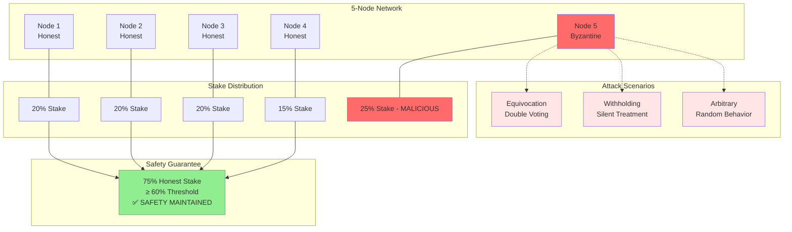

```mermaid
graph TB
    subgraph "5-Node Network"
        N1[Node 1<br/>Honest]
        N2[Node 2<br/>Honest]
        N3[Node 3<br/>Honest]
        N4[Node 4<br/>Honest]
        N5[Node 5<br/>Byzantine]
    end
    
    subgraph "Stake Distribution"
        S1[20% Stake]
        S2[20% Stake]
        S3[20% Stake]
        S4[15% Stake]
        S5[25% Stake - MALICIOUS]
    end
    
    N1 --- S1
    N2 --- S2
    N3 --- S3
    N4 --- S4
    N5 --- S5
    
    subgraph "Attack Scenarios"
        A1[Equivocation<br/>Double Voting]
        A2[Withholding<br/>Silent Treatment]
        A3[Arbitrary<br/>Random Behavior]
    end
    
    N5 -.-> A1
    N5 -.-> A2
    N5 -.-> A3
    
    subgraph "Safety Guarantee"
        SG[75% Honest Stake<br/>≥ 60% Threshold<br/>✅ SAFETY MAINTAINED]
    end
    
    S1 --> SG
    S2 --> SG
    S3 --> SG
    S4 --> SG
    
    style N5 fill:#FF6B6B
    style S5 fill:#FF6B6B
    style SG fill:#90EE90
    style A1 fill:#FFE5E5
    style A2 fill:#FFE5E5
    style A3 fill:#FFE5E5
```