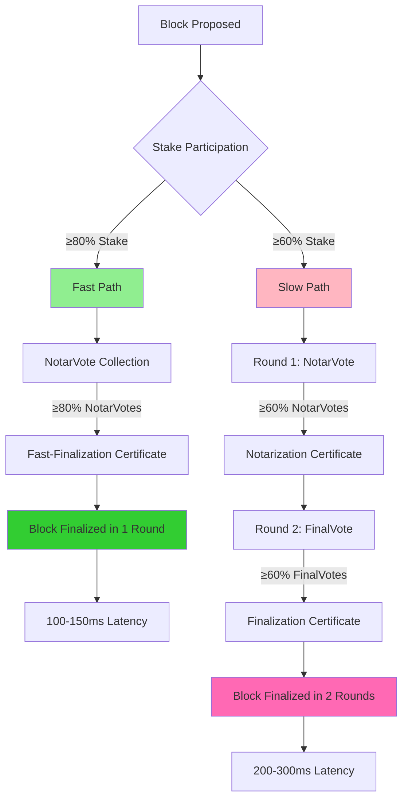

```mermaid
graph TD
    A[Block Proposed] --> B{Stake Participation}
    B -->|≥80% Stake| C[Fast Path]
    B -->|≥60% Stake| D[Slow Path]
    
    C --> E[NotarVote Collection]
    E -->|≥80% NotarVotes| F[Fast-Finalization Certificate]
    F --> G[Block Finalized in 1 Round]
    G --> H[100-150ms Latency]
    
    D --> I[Round 1: NotarVote]
    I -->|≥60% NotarVotes| J[Notarization Certificate]
    J --> K[Round 2: FinalVote]
    K -->|≥60% FinalVotes| L[Finalization Certificate]
    L --> M[Block Finalized in 2 Rounds]
    M --> N[200-300ms Latency]
    
    style C fill:#90EE90
    style D fill:#FFB6C1
    style G fill:#32CD32
    style M fill:#FF69B4
```