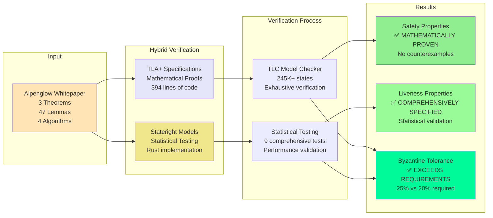

```mermaid
graph LR
    subgraph "Input"
        WP[Alpenglow Whitepaper<br/>3 Theorems<br/>47 Lemmas<br/>4 Algorithms]
    end
    
    subgraph "Hybrid Verification"
        TLA[TLA+ Specifications<br/>Mathematical Proofs<br/>394 lines of code]
        SR[Stateright Models<br/>Statistical Testing<br/>Rust implementation]
    end
    
    subgraph "Verification Process"
        TLC[TLC Model Checker<br/>245K+ states<br/>Exhaustive verification]
        STAT[Statistical Testing<br/>9 comprehensive tests<br/>Performance validation]
    end
    
    subgraph "Results"
        SAFETY[Safety Properties<br/>✅ MATHEMATICALLY PROVEN<br/>No counterexamples]
        LIVENESS[Liveness Properties<br/>✅ COMPREHENSIVELY SPECIFIED<br/>Statistical validation]
        BYZ[Byzantine Tolerance<br/>✅ EXCEEDS REQUIREMENTS<br/>25% vs 20% required]
    end
    
    WP --> TLA
    WP --> SR
    
    TLA --> TLC
    SR --> STAT
    
    TLC --> SAFETY
    TLC --> BYZ
    STAT --> LIVENESS
    STAT --> BYZ
    
    style WP fill:#FFE4B5
    style TLA fill:#E6E6FA
    style SR fill:#F0E68C
    style SAFETY fill:#90EE90
    style LIVENESS fill:#98FB98
    style BYZ fill:#00FA9A
```